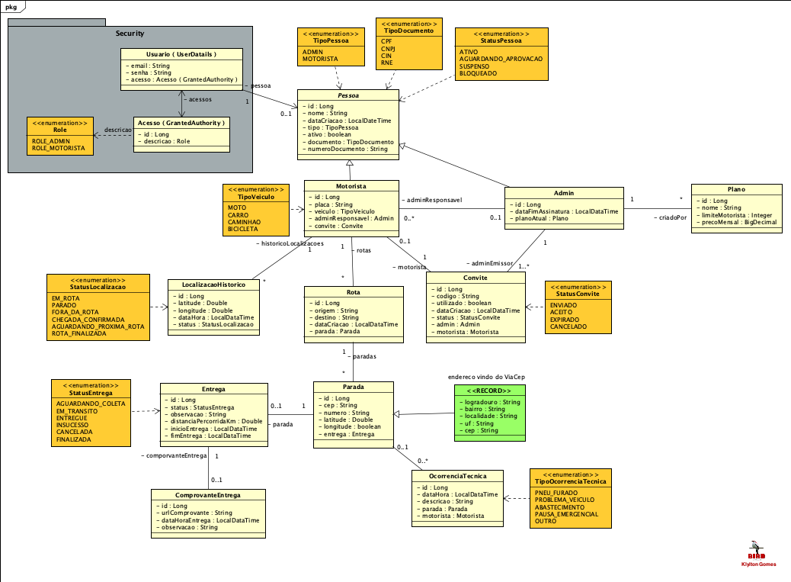

# 🚚 Rastro Miv

Sistema backend para gerenciamento de rotas, motoristas, entregas e acompanhamento logístico em tempo real.

---

## 🖼️ Diagrama de Classes (UML)

> Representação geral da estrutura de classes do sistema:

---

## ⚙️ Tecnologias utilizadas

- Java 21
- Spring Boot 3
- Spring Security
- Flyway (migrations)
- Banco H2 (testes) e PostgreSQL (produção)
- Maven

---

## 📌 Funcionalidades principais

- Cadastro de **usuários**, **motoristas** e **admins**
- Sistema de **convites** para associar motoristas aos admins
- Gestão de **rotas** com múltiplas **paradas** e **entregas**
- Histórico de **localização** com atualização por status (em rota, parado etc.)
- Registro de **ocorrências técnicas** na rota (ex: problemas mecânicos)
- Integração com a **API ViaCEP** para preenchimento automático de endereços

---

## 🧑‍💻 Desenvolvedor

**Klylton Gomes**  
[🔗 GitHub](https://github.com/KlyltonGomes)

---

## 📝 Licença

Este projeto está licenciado sob os termos da **MIT License**.  
Veja o arquivo [LICENSE](./LICENSE) para mais detalhes.
